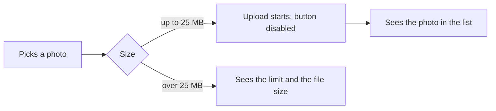

# Create a pull request

Two modes, picked by what the user asked for:

- **Describe only**: write the title and body, show them, stop.
- **Create or update**: write them, then run `gh`. "Make a PR" means this one.

## 1. Collect the facts

You MUST NOT guess what the change does. Read it.

```bash
git rev-parse --abbrev-ref HEAD                  # current branch
git log --oneline "$base"..HEAD                  # commits on this branch
git diff --stat "$base"...HEAD                   # files touched
git diff "$base"...HEAD                          # the actual change
GH_PAGER=cat gh pr view --json number,title,body # PR already open?
```

`$base` is the branch this one came off. Work it out once:

```bash
remote=$(git remote | grep -qx origin && echo origin || git remote | head -1)
base=$remote/$(GH_PAGER=cat gh repo view --json defaultBranchRef \
  -q .defaultBranchRef.name)
```

The remote is `origin` almost everywhere, and on a fork or a mirror it is not.
Its name MUST be read, rather than typed.

Also check:

- A PR template: `.github/pull_request_template.md` or files under
  `.github/PULL_REQUEST_TEMPLATE/`.
- The repo's commit and PR rules: `CONTRIBUTING.md`, `AGENTS.md`, `CLAUDE.md`.
- An issue id in the branch name or commits (`PROJ-123`, `JIRA-123`, `#42`).

Repo rules MUST win over this skill. With a template, keep the parts it demands
(checkboxes, headings) and put the sections below inside it.

## 2. Title

The title MUST follow the repo's commit convention. Common ones:

- `PROJ-123: add page pattern examples` (issue id prefix)
- `feat(auth): add page pattern examples` (conventional commits)

No convention? One short imperative sentence: what the change does, not how.

## 3. Body

You MUST load the `writing-style` skill before the first line, the way section 4
says.

A Jira ticket covers this change? Its name MUST go on the first line of the
body, alone, before the sections: `PROJ-123`. Name only, no link. Find it in the
branch name or the commits, ask if neither has one, skip the line if there is no
ticket.

Then these sections, in this order. `Try it` goes in only when the change adds
or changes a command. `Generated by commands` goes in only when a command wrote
or rewrote files in the diff. The prose MUST stay under 20 lines, and the
diagram and command blocks don't count. It is read on a phone, in a notification, by
someone who has not opened the diff.

````markdown
## What problem this solves

<Who was hurting and how. One or two sentences, the symptom a person could see,
not the internals. Three symptoms or more go in bullets instead.>

## How it works now

<What the change does, in order. Two to five bullets, one line each. Each one
opens with its point in bold, then the behaviour. The file name only if it
helps.>

## User flow

```mermaid
flowchart LR
  <what the person does and sees, step by step>
```

## Try it

```console
$ <the exact command, with real arguments>
<the output to expect>
```

## Reused code and packages

<What the change reuses from this repo, one line each: the name, where it sits,
what it does here. Then every dependency it adds: the name, what it does, its
size. Then the packages you looked at and turned down, with the reason. Nothing
added? Write "No new packages." and, if a well known package would have fit,
say why you wrote it by hand instead.>

## Generated by commands

<Which part of the diff came out of the commands below, in one line, so the
reviewer reruns them instead of reading it.>

```bash
# <the files this command wrote>
<the exact command, run from the repo root>
```
````

A paragraph MUST stop at three lines, and a bullet at two. Over the cap? Cut a
bullet, the wording stays as it is.

### User flow

The diagram shows the paths a person takes through the change. GitHub renders
the `mermaid` block as a picture.

- Each path the change adds or changes MUST be drawn. Untouched paths stay out.
- A node is an action or a screen, in plain words: "Picks a photo", "Sees the
  size error". File and function names MUST stay out.
- A branch (error, cancel, retry) gets its own arrow with a label:
  `-->|over 25 MB|`.
- A diagram SHOULD stop at ten nodes. A bigger change gets one diagram per
  flow.
- A label with brackets, quotes or a colon MUST sit in double quotes, or GitHub
  fails to render the block.

No person in the loop, as in a CI job or a migration? Draw what starts it and
what comes out.

### Try it

This section is for a new or changed command: a CLI, a script, a `package.json`
script, a Make target, a slash command, a new flag.

- Show the exact line a person types, with real arguments, then what it prints.
- Run it when it is local and safe, and paste the real output, trimmed to the
  lines a person checks.
- A command that touches shared systems or needs secrets MUST NOT be run. Write
  the output from the code and add `# expected, not run` above it.
- A command that checks its input SHOULD also show one bad input and its error.

```console
$ todo add "Buy milk" --due friday
Added #14 "Buy milk", due Fri 10 Oct
$ todo add ""
error: the title is empty
```

### What belongs in Reused code and packages

Reused code first, then packages.

**Reused** means code that sat in the repo before this branch and the change now
calls: a helper, a component, a hook, a service, a type.

- Find it in the imports and calls the diff adds. Anything outside the files
  the branch created counts: `git diff --diff-filter=A --name-only "$base"...HEAD`.
- Each line names the thing, where it sits and what it does here.
- The list SHOULD stop at five. What a reviewer would expect to see written anew
  goes first.
- Nothing worth naming? Leave the reused lines out.

**Packages** means third party code the change now depends on, or would have. A
new peer or dev dependency counts.

The repo's own tooling MUST stay out of both: Vitest, Nx, the linter. Same for
MCP servers, editors and agents. A command that wrote code goes under Generated
by commands instead.

You MUST check the diff before writing about packages. A package the manifest
doesn't show MUST NOT be claimed:
`git diff "$base"...HEAD -- '**/package.json' 'package.json'`.

A turned-down package MUST carry its reason in a few words: size, unmaintained,
its licence, it drags in a lot, the repo already does the job, or the
hand-written version is ten lines.

Examples:

- "Reuses `formatBytes` from `src/utils/format.ts` to print the limit."
- "`date-fns` 3.6, 2 kB after tree shaking, formats the due dates."
- "Turned down `moment`: 70 kB and no tree shaking."
- "No new packages. `lodash.groupby` would have done it, but `Object.groupBy`
  ships in every browser we support."

### Generated by commands

A command belongs here when it wrote or rewrote files the diff carries: a
generator, a codemod, a `sed` or `ast-grep` rewrite, a schema or API client
generator, `pnpm add` changing the lockfile, `vitest -u` writing snapshots.

- Each command MUST be the exact line, real arguments, in the order you ran it.
  The reviewer reruns it and diffs the result.
- A comment above each command SHOULD name the files it wrote.
- A generated file edited by hand afterwards MUST be named, or the reviewer
  skips it as generated.
- Commands that only read or check stay out: `git`, `grep`, tests, a build whose
  output isn't committed.

Find them in your own session first, then in the commit messages, then in the
diff: a "generated" header, a lockfile, a snapshot. A command you can't recover
MUST NOT be made up. Ask the user.

```bash
# libs/upload/** and its path in tsconfig.base.json
pnpm nx g @nx/js:library upload --directory=libs/upload
# every getSize call under apps/web
ast-grep run -p 'getSize($A)' -r 'formatBytes($A)' -U apps/web
```

## 4. How to write it

You MUST load the `writing-style` skill first, from `writing-style/SKILL.md` in
this skills folder. It holds every rule about the words and the checklist to run
before posting, and its "Shape on the page" section sets the layout. Load it
once, unless it is in context.

Only these are the PR body's own:

- It MUST land on the first read, with zero context on this codebase.
- A section heading already says what the section is, so the line under it MUST
  start with the fact.
- The change MUST be there, the work MUST NOT: what the code does now, no line
  counts, no file counts, no "refactored". Generated by commands is the one
  place for how the code got written.
- A guess MUST be marked as a guess.

Reread the body once before posting, and every word the reader can do without
MUST go.

## 5. Create or update the PR

Every `gh` MUST carry the `GH_PAGER=cat` prefix, or it opens a pager and hangs.

Push first when the branch has no upstream:

```bash
git push -u "$remote" HEAD
```

New PR:

```bash
GH_PAGER=cat gh pr create --base <base> --title "<title>" --body-file <file>
```

Write the body to a temp file rather than passing it inline, so newlines and
backticks survive.

Existing PR:

```bash
GH_PAGER=cat gh pr edit --title "<title>" --body-file <file>
```

`--draft` MAY go in only when the user asked for a draft.

After a rebase or force push, `gh pr view --json mergeable` can report a stale
conflict. Any edit resets it, so re-query once when the answer looks wrong.

## 6. Report back

One or two lines: the PR link and the title. Nothing else.

## Guardrails

- A push or a PR on a protected or default branch MUST NOT happen. Stop and say
  so.
- A problem statement MUST NOT be invented. The diff doesn't say why the change
  exists? Ask the user one question.
- Force pushing, amending published commits and `--no-verify` MUST NOT happen.
- Unrelated staged or untracked files MUST be left alone.

## Example body

````markdown
PROJ-123

## What problem this solves

Uploading a photo over 5 MB failed with a blank screen. People retried the same
file several times and then gave up, so support got about 30 tickets a week.

## How it works now

- **Cap** files up to 25 MB upload. The old cap was 5 MB.
- **Too big** the error names the limit and the file's own size, so the person
  knows what to do next.
- **Double submit** the upload button stays disabled while a file is in flight.

## User flow



## Reused code and packages

- Reuses `formatBytes` from `src/utils/format.ts` to print both sizes.
- `browser-image-compression` 2.0, 12 kB, shrinks a photo in the browser
  before it goes up.
- Turned down `sharp`: it only runs on the server, and the point here is to
  cut the upload before it starts.
- Turned down `filesize`: `formatBytes` already prints "25 MB".
````
